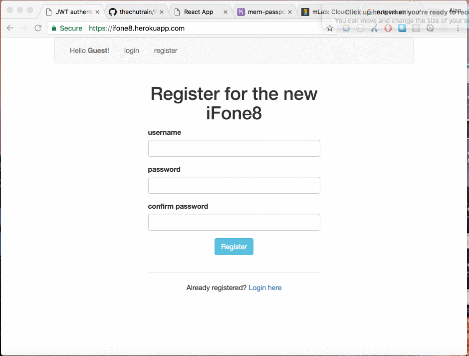

### iFone8

> browser-based phone app that allows authenticated users to call any phone number

RU-hackathon project April 2017
---------------------------------
Wayy cooler and better the iphone7, is the newest iFone8. Just bring your favorite desktop, table or computing device (the bigger the screen the better!) and make phone calls to any of your friends or any phone number with the virtual iFone8. It requires you to have wi-fi signal.

Demo
-------------

Checkout the live demo here: [Demo](https://ifone8.herokuapp.com/)

Bugs
-------------
Find a bug? Want to help me out? Submit an issue [here](https://github.com/thechutrain/RU-hackathon/issues)

Contributers
--------------
* [Alan Chu](https://github.com/thechutrain)
